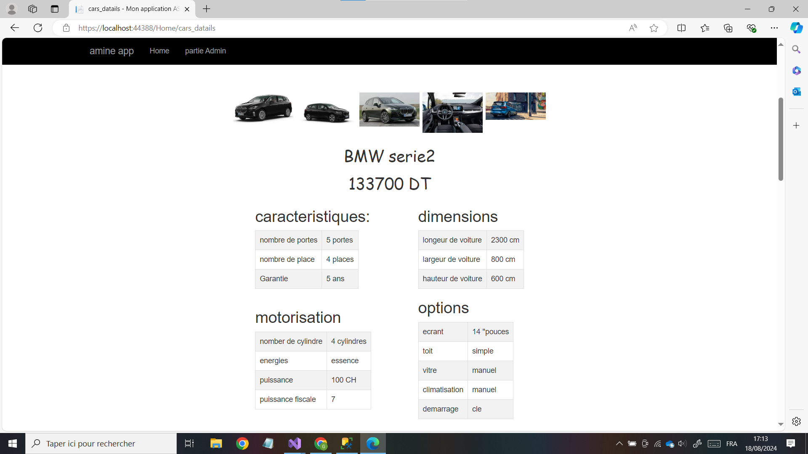

# Développement d'un Site Web pour la Présentation des Voitures en Tunisie

**Description :**

Développement d'un site web pour la présentation des voitures disponibles sur le marché tunisien. Le site utilise les technologies suivantes :

- **ASP.NET** : Pour le développement du backend et la gestion des interactions serveur.
- **JavaScript** : Utilisé pour les fonctionnalités interactives et dynamiques du site.
  - **jQuery** 
  - **AJAX** 
- **SQL Server** : Pour la gestion et le stockage des données relatives aux voitures et aux utilisateurs.

**Fonctionnalités principales :**

- Présentation des modèles de voitures disponibles sur le marché tunisien.
- Informations détaillées sur chaque voiture (caractéristiques, prix, photos, etc.).
- Recherche et filtrage des voitures en fonction de divers critères.
- Interface utilisateur interactive et responsive.

**Points clés :**
-Technologies utilisées : ASP.NET, JavaScript (avec jQuery et AJAX), SQL Server.
-Fonctionnalités principales : Présentation des voitures, informations détaillées, recherche et filtrage, interface utilisateur interactive.

**Démonstration des images :**

Voici une petite démonstration :

---
Cette version est développée par Mohamed Amine Ghamgui.
